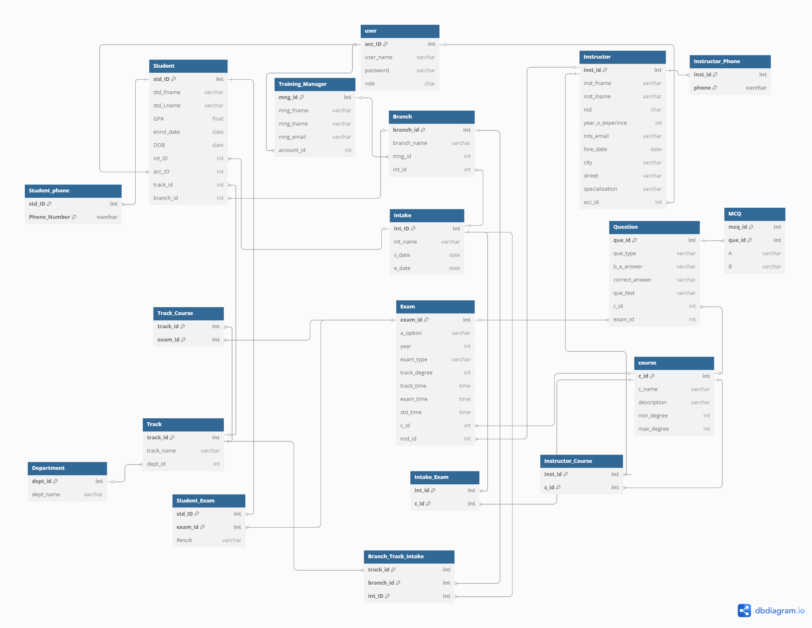

# Examination-System
It simulates a real-world examination system with full database modeling and implementation.

our system has 12 files  
			Each file has each persona in system 

our system has 4 logins accounts:
	Admin                Windo - auth
	Tranining Manager    123478
	Student              123489
	Instructor           123410 

our system has some of process as explained:
	System Req:
       	        Accounts Permissions                                             Created by: Mostafa Hamed
		Make Indexed  Database                                                      
		Backup:  --Full Back up every 10 monthes                                 
		         --Daily Back up    (Automatically)                
	   
	   
	  Instructor can make exam (His Course only)                      Created by: Mohamed Saleh 
	         *can set question of exam  
			 *can set degree of each Question.
			 *can set total degree.
			 *can select student to make exam
			 *can select date of exam , start time , end time , total time.
			 
			 
			 *can identify which type of exam.                        Created by: Ahmed Hesham 
			 *can select intake , branch, track, course (Inside exam)  )
			 *System Can correct exam and detect the best answer for question (Bouns)(All question types)
	

	
      Student:                                                        Created By: Mahmoud abdelkhalek
	        *can log in into system.
			*can take exam twice.
			*can discover his degree of exam.      
			
			
			
			
	 Tranining Manager:                                              Created By: Nada Zohny 
		       *can edit and add: 
             			    branches 
					     	track 
					    	intake
						    student and his personal data.
							
				*Permissions of all training managers 
		
		

Entity Relationship Diagram (ERD)

Mapping 

Trello 

